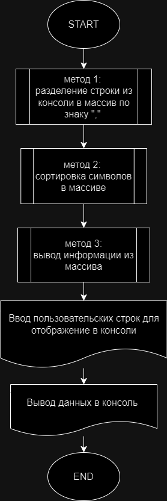

## Итоговая работа.

### Задача:
Написать программу, которая из имеющегося массива строк 
формирует массив из строк, длина которых меньше либо
равна 3 символам. Первоначальный массив можно ввести с клавиатуры, либо задать на старте выполнения алгоритма.
При решении не рекомендуется пользоваться коллекциями,
лучше обойтись исключительно массивами.

[Текст итоговой контрольной работы по основному блоку](Final_Test.md)

Блок-схема:




### Решение задачи:

1. Разделение строки из консоли в массив через запятую c помощью метода `GetArrayStringConsole`:
```cs
string[] GetArrayStringConsole (string consoleText)
{
    string[] arrayText = new string[consoleText.Length];
    arrayText = consoleText.Split(",");
    return arrayText;
}
```

2. Сортировка символов из массива с помощью метода `GetArrayThreeSimvol`:
```cs
string[] GetArrayThreeSimvol (string[] array)
{
    int temp = 0;
    for (int i = 0; i < array.Length; i++)
    {
        string simvol = array[i];
        if (simvol.Length <= 3)
        {
            temp++;
        }
    }
    string[] arrayThreeSimvol = new string[temp];
    for (int i = 0, j = 0; i < array.Length; i++)
    {
        string simvol = array[i];
        if (simvol.Length <= 3)
        {
            arrayThreeSimvol[j] = simvol;
            j++;
        }
    }
    return arrayThreeSimvol;
}
```

3. Вывод информации из массива в консоль с помощью метода `PrintArray`:
```cs
void PrintArray (string[] array)
{
    for (int i = 0; i < array.Length; i++)
    {
        Console.Write($"{array[i]}, ");
    }
    Console.WriteLine();
}
```

4. Создание пользовательского ввод текста для вызова вышеуказанных методов:
```cs
Console.Write("Введите набор символов через запятую: ");
string inStringSimvol = Console.ReadLine() ?? "";
string[] arraySimvol = GetArrayStringConsole(inStringSimvol);
Console.WriteLine();
Console.Write("Введенные символы: ");
PrintArray(arraySimvol);
Console.WriteLine();
Console.Write("Введенные символы, длина которых меньше либо равно 3: ");
PrintArray(GetArrayThreeSimvol(arraySimvol));
Console.WriteLine();
```